# SunnySideUp - Singapore Weather Dashboard

[](https://sunnysideup-one.vercel.app)
[](https://github.com/sayyidkhan/sunnysideup)

A comprehensive weather monitoring application for Singapore that provides detailed insights into:
- 🌡️ Temperature variations and forecasts
- 💧 Humidity levels across different regions
- ☀️ Solar radiation measurements and predictions
- 🗺️ Location-specific weather conditions

Built with modern web technologies to deliver real-time weather data visualization and forecasting.

## Table of Contents
1. [Key Features](#key-features)
   - [Search Bar Features: Interactive Map Controls](#search-bar-features-interactive-map-controls)
   - [Weather Forecast Charts](#weather-forecast-charts)
   - [Performance Metrics](#performance-metrics)
2. [Application Preview](#application-preview)
   - [Main Dashboard](#main-dashboard)
   - [Detailed Weather Insights](#detailed-weather-insights)
   - [Collapsed Dashboard View](#collapsed-dashboard-view)
   - [Location Search](#location-search)
3. [Tech Stack](#tech-stack)
   - [Core Technologies](#core-technologies)
   - [UI & Styling](#ui--styling)
   - [Maps & Visualization](#maps--visualization)
   - [Code Quality](#code-quality)
4. [Environment Setup](#environment-setup)
5. [How to Run and Get Started with the App](#how-to-run-and-get-started-with-the-app)
6. [Project Structure](#project-structure)
7. [Available APIs](#available-apis)
8. [Testing](#testing)
   - [Running Tests](#running-tests)
   - [Weather API Tests](#weather-api-tests)
   - [Test Structure](#test-structure)

## Key Features

### Search Bar Features: Interactive Map Controls
- 🔍 **Zoom In**: Magnify specific areas on the map for detailed view
- 🔎 **Zoom Out**: Expand view to see larger map area
- 🔍 **Searchbar**: Quick location search with intelligent autocomplete suggestions
- 🔔 **Notifications**: Ready for future implementation of weather alerts
- 📊 **Dashboard**: Toggle to open/close the weather insights dashboard
- 👤 **User**: Reset view to Singapore (default location) with centered red marker and reset dashboard

### Weather Forecast Charts
- 📈 **Temperature Forecast**: Daily temperature trends and predictions for the next 10 days
- 💧 **Humidity Analysis**: Comprehensive humidity data visualization from today to 10 days ahead
- ☀️ **Solar Radiation Tracking**: Daily solar radiation levels and forecasts for the next 10 days

### Performance Metrics
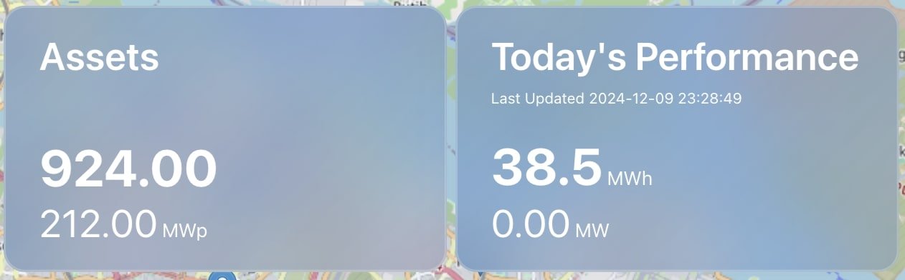

- 🌞 **Total Radiation (Assets)**
  - Displays cumulative solar radiation collected
  - Shows maximum radiation value per day (MWp - Peak Megawatt)
- ⚡ **Today's Performance**
  - Average hourly radiation (Total daily radiation/24 hours in MWh)
  - Real-time current hour radiation value (MW)
- 🕒 **Last Updated**: Timestamp showing most recent data refresh


## Application Preview
Here's a quick look at what SunnySideUp offers across different devices:

### Main Dashboard
<details>
<summary>View Screenshots</summary>

#### Desktop View
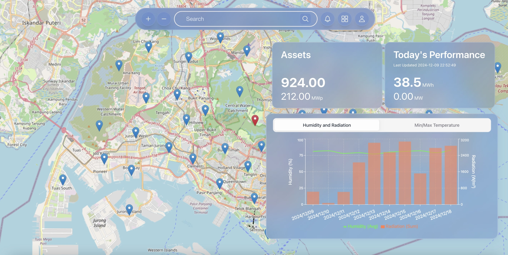

#### Tablet View
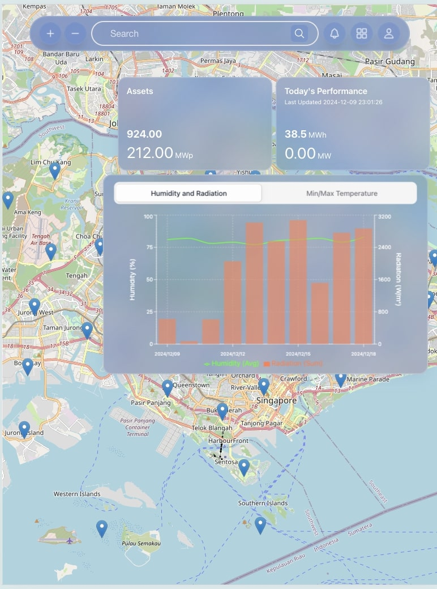

#### Mobile View
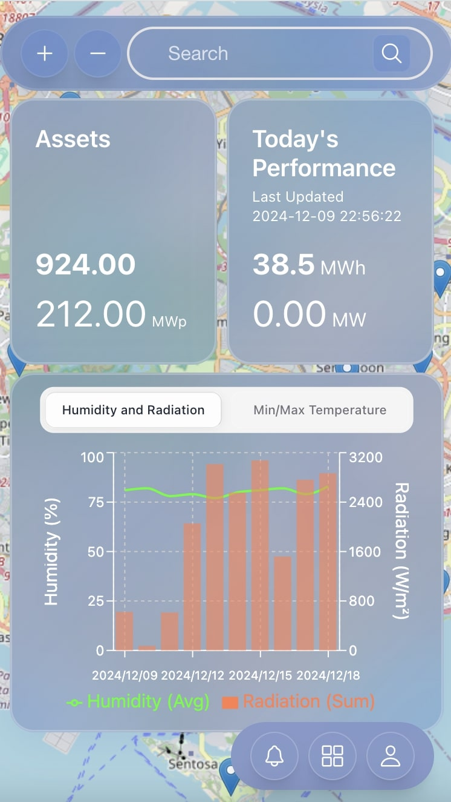
</details>

### Detailed Weather Insights
<details>
<summary>View Screenshots</summary>

#### Desktop View
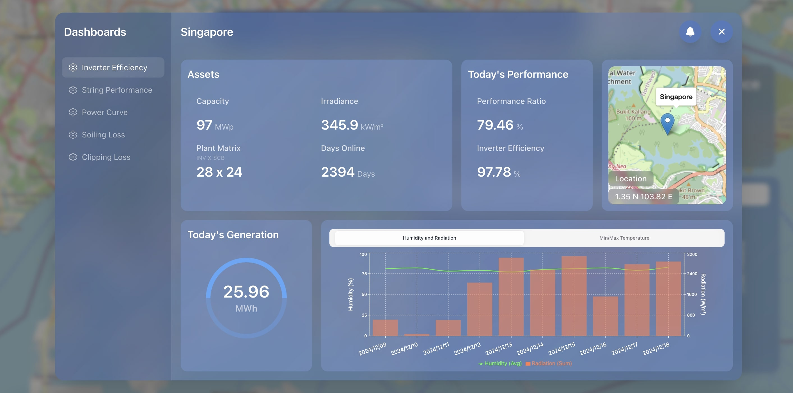

#### Tablet View
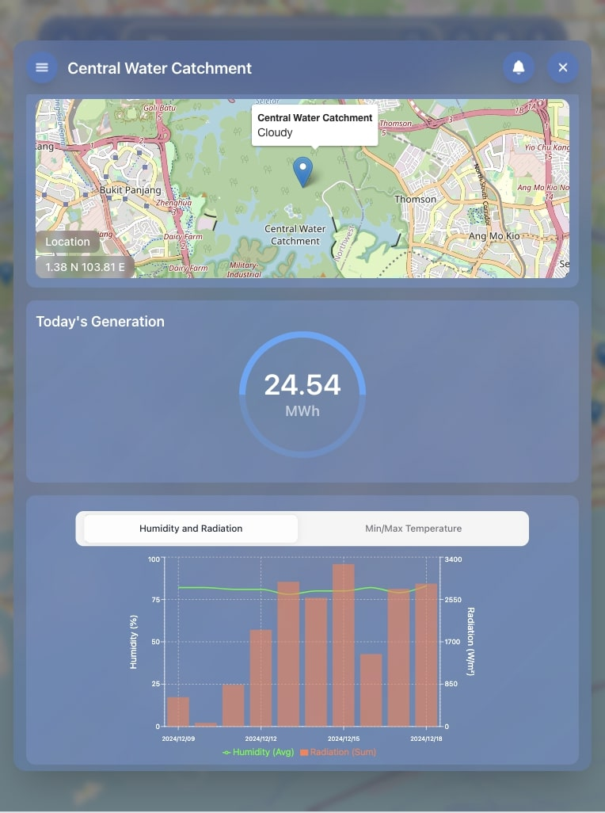

#### Mobile Views
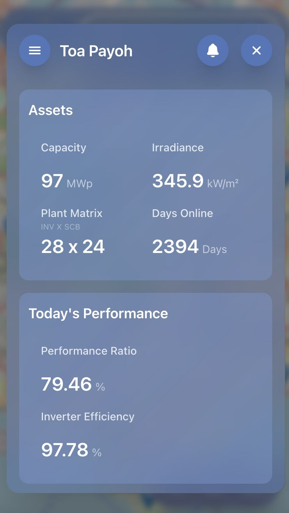
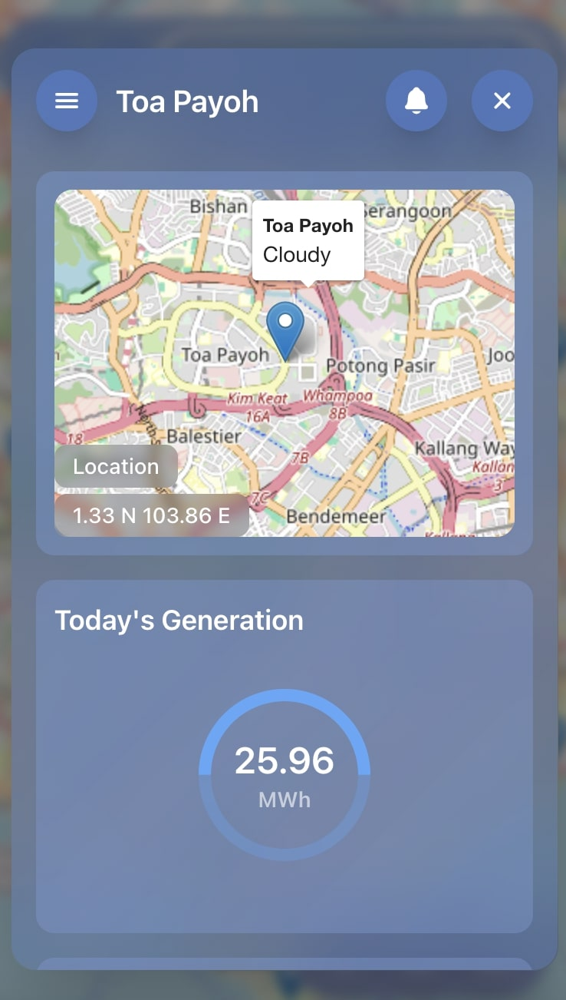
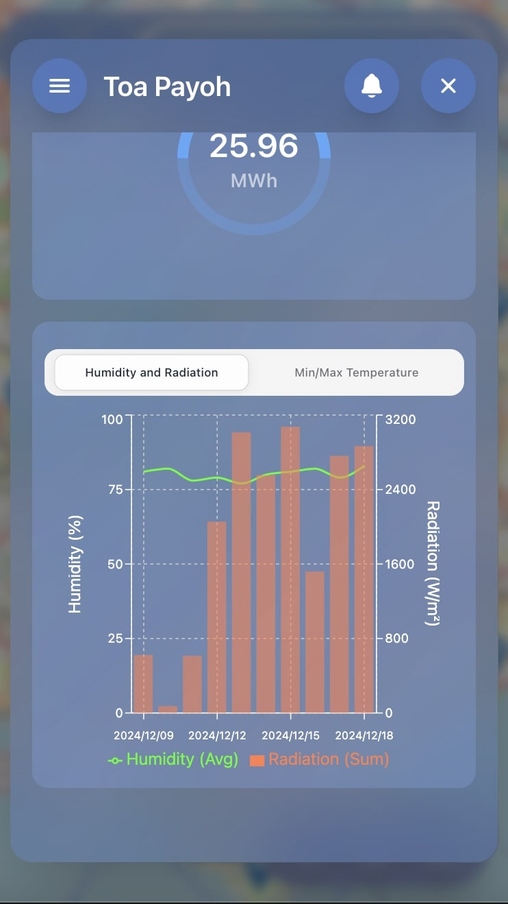
</details>

### Collapsed Dashboard View
<details>
<summary>View Screenshots</summary>

#### Desktop View
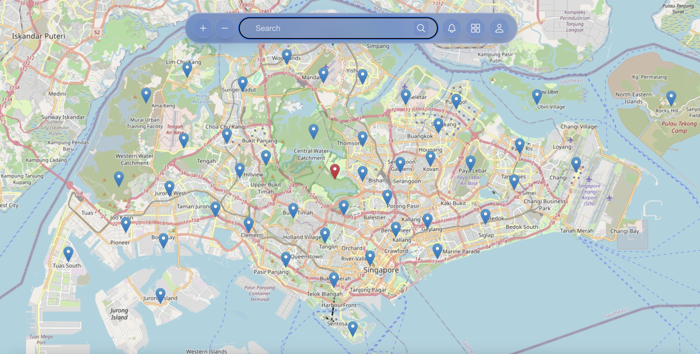

#### Tablet View
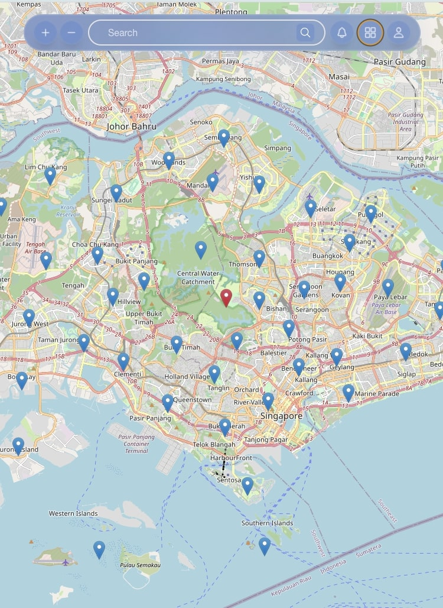

#### Mobile View
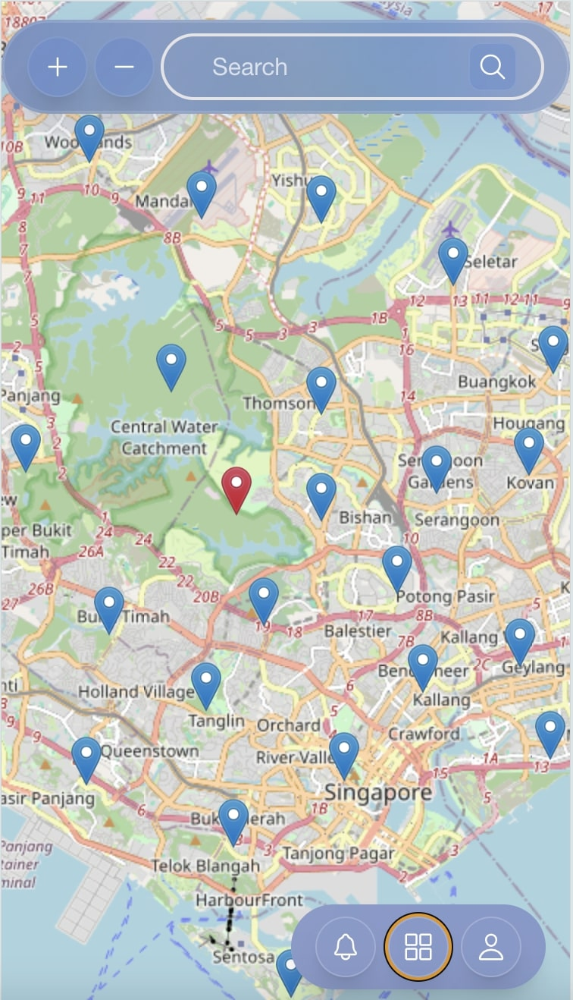
</details>

### Location Search
<details>
<summary>View Screenshots</summary>

#### Desktop View
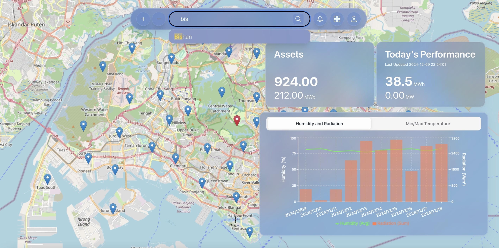

#### Tablet View
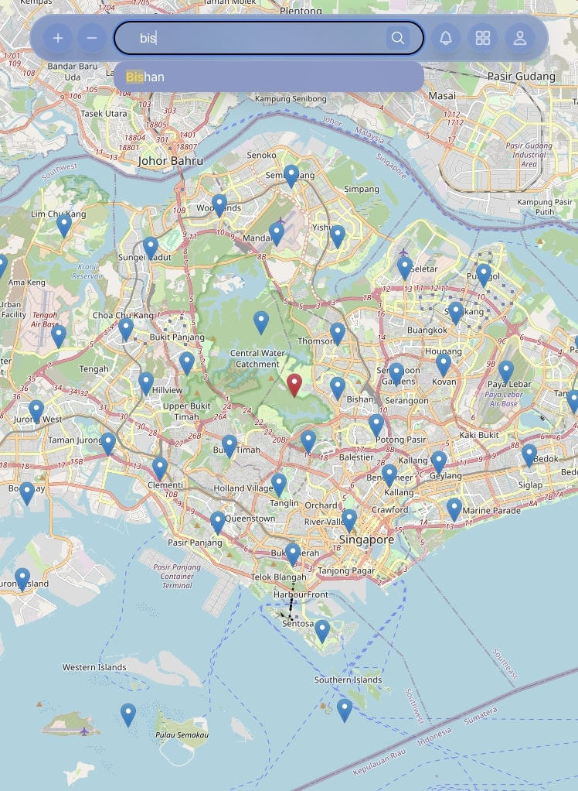

#### Mobile View
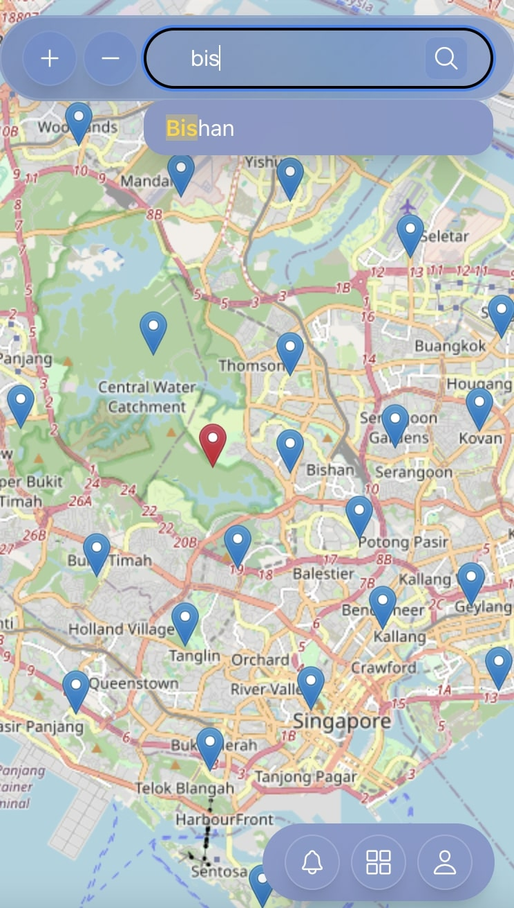
</details>

## Tech Stack

#### Core Technologies
- **React** - A JavaScript library for building user interfaces
- **Vite** - Next-generation frontend build tool, offering faster development experience
- **TypeScript** - Adds static typing to JavaScript for better code quality and developer experience
- **Vercel** - Cloud platform for deployment and hosting, providing seamless CI/CD pipeline

#### UI & Styling
- **NextUI** - Modern, fast and beautiful React UI library built with TailwindCSS
- **TailwindCSS** - Utility-first CSS framework for rapid UI development
- **React Icons** - Include popular icon packs as React components

#### Maps & Visualization
- **React Leaflet** - React components for interactive Singapore map visualization
- **Recharts** - Composable charting library for weather data visualization

#### Code Quality
- **ESLint** - Code linting tool to identify and fix problems in JavaScript/TypeScript code
- **Prettier** - Code formatter that ensures consistent code style

## Environment Setup

### Recommended Extensions
- ESLint
- Prettier
- Tailwind CSS IntelliSense
- JavaScript and TypeScript Intellisense

## How to Run and Get Started with the App

### Prerequisites
- Node.js (v22)
- npm (comes with Node.js)

### Installation
```bash
# Clone the repository
git clone https://github.com/yourusername/sunnysideup.git

# Navigate to project directory
cd sunnysideup

# Install dependencies
npm install
```

### Development
```bash
# Start development server
npm run dev
```
This will start the development server at `http://localhost:5173`

### Production Build
```bash
# Create production build
npm run build

# Preview production build locally
npm run preview
```

### Code Quality
```bash
# Run linter
npm run lint
```

## Project Structure

The project follows a feature-based organization to maintain scalability and separation of concerns:

```
src/
├── main.jsx                   # Application entry point
├── App.jsx                    # Root application component
├── App.css                    # Application-level styles
├── index.css                  # Global styles and Tailwind imports
├── components/
│   ├── WeatherMap.jsx         # Main Map visualization component
│   ├── common/                # Reusable UI components
│   │   ├── SearchBar.jsx      # Location search component
│   │   ├── charts/            # Reusable chart components
│   │   └── minimap/           # Mini map components
│   ├── detailedInsights/      # Detailed weather analysis components
│   │   ├── charts/            # Detailed chart visualizations
│   │   ├── cards/             # Information cards
│   │   └── contentGrid/       # Grid layout components
│   └── mainInsights/          # Main dashboard components
│       ├── charts/            # Chart components for weather data
│       └── cards/             # Card components for quick insights
├── api/
│   └── weather/               # Weather API integration and data fetching
├── utils/                     # Helper functions and utilities
└── assets/                    # Static assets and images
```

### Key Directories

- **Root Files**:
  - `main.jsx`: Application entry point, renders the App component
  - `App.jsx`: Root component containing the main layout and routing
  - `App.css`: Component-specific styles for App component
  - `index.css`: Global styles and Tailwind CSS configuration

- **components/**: React components organized by feature
  - `WeatherMap.jsx`: Main Map-related component for location-based weather
  - `common/`: Reusable UI components
    - `SearchBar.jsx`: Location search functionality with autocomplete
    - `charts/`: Common chart components shared across features
    - `minimap/`: Small map components for location previews
  - `detailedInsights/`: Components for detailed weather analysis
    - `charts/`: Advanced weather data visualizations
    - `cards/`: Detailed information display cards
    - `contentGrid/`: Layout components for content organization
  - `mainInsights/`: Components for the main dashboard view

- **api/**: API integration layer
  - Weather data fetching and processing
  - API response type definitions
  - Error handling utilities

- **utils/**: Helper functions and utilities
  - Common helper functions
  - Constants and configurations

### Configuration Files

- `vite.config.ts`: Vite configuration
- `tailwind.config.js`: TailwindCSS customization
- `tsconfig.json`: TypeScript compiler configuration
- `eslint.config.js`: ESLint configuration (new format)
- `jest.config.js`: Jest testing framework configuration
- `.prettierrc`: Code formatting rules
- `vercel.json`: Vercel deployment and routing configuration

## Testing

Jest is used for testing. Test files are located alongside their corresponding implementation files with `.test.ts` or `.test.tsx` extensions.

### Running Tests

```bash
# Run all tests
npm test

# Run tests in watch mode
npm run test:watch

# Run specific test files
npx jest src/api/weather/sg-forecast-singapore.test.ts    # Singapore forecast
npx jest src/api/weather/sg-forecast-angmokio.test.ts     # Ang Mo Kio forecast
npx jest src/api/weather/sg-location-singapore.test.ts    # 2-hour location forecast
npx jest src/api/weather/sg-forecast-hourly-singapore.test.ts  # Hourly radiation forecast
```

Watch mode options (run `npm run test:watch` first):
- `f` - run failed tests: `npm run test:watch` then press `f`
- `p` - filter by filename: `npm run test:watch` then `p` and type `forecast`
- `t` - filter by test name: `npm run test:watch` then `t` and type `temperature`
- `q` - quit watch mode: `npm run test:watch` then press `q`

### Weather API Tests

The project includes tests for:

1. **10-Day Forecast**
   - Singapore and Ang Mo Kio areas
   - Validates temperature, humidity, solar radiation, and location data

2. **2-Hour Location Forecast**
   - Covers 47 Singapore locations
   - Validates coordinates, weather conditions, and forecast timestamps

3. **Hourly Radiation Forecast**
   - Validates radiation data for Singapore
   - Tests current hour, peak hour, and daily sum values
   - Verifies timezone and update timestamps

### Test Structure

```
src/
  api/
    weather/
      sg-forecast.ts
      sg-forecast.test.ts      # Implementation and test files
      sg-location.ts           # are kept together
      sg-location.test.ts
```

### Writing Tests

Test files should be created next to the file they are testing with a `.test.ts` or `.test.tsx` extension. For example:
```typescript
describe('Feature Name', () => {
  it('TEST DESCRIPTION', async () => {
    // First fetch the data
    const data = await fetchSomeData();
    
    // Test data structure with example JSON
    //   "exampleField": {
    //     "key": "value"
    //   }
    expect(data.exampleField).toBeDefined();
    
    // Test specific values
    expect(data.exampleField.key).toBe('value');
    
    // Log sample data
    console.log('Sample Data:', JSON.stringify(data, null, 2));
  });
});

```

## Available APIs

All forecast data includes predictions from the current date plus the next 10 days, providing comprehensive coverage for weather planning and analysis. The hourly radiation data focuses on the current day's measurements and predictions.

```typescript
// Weather Data
const data = await fetchSGMainDailyForecast({
  latitude?: number,    // Optional: defaults to Singapore
  longitude?: number,   // Optional: defaults to Singapore
  timezone?: string    // Optional: defaults to 'Asia/Singapore'
});

// Data Processing Functions
// Components using: MainInsightsChart, DetailInsightsChart
const tempData = fetchDailyTemp(data);                    // Get 10-day temperature forecast

// Components using: MainInsightsChart, DetailInsightsChart
const humidityData = fetchDailyHumidityAndRadiation(data);  // Get humidity and radiation data

// Components using: MainInsightsCards
const hourlyData = await fetchSGHourlyRadiationForecast();  // Get hourly radiation updates

// Components using: WeatherMap
const locationData = await fetchDailyLocationAndForecast();  // Get 2-hour forecast for 47 locations
